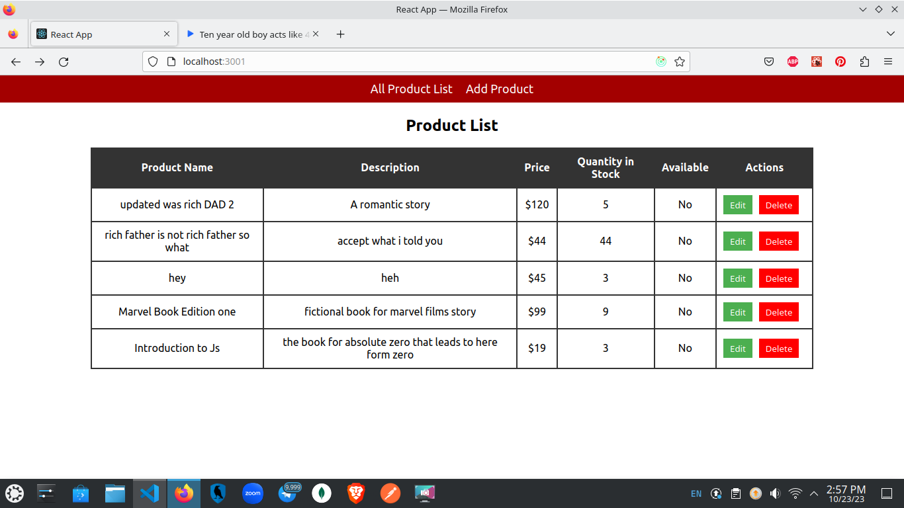
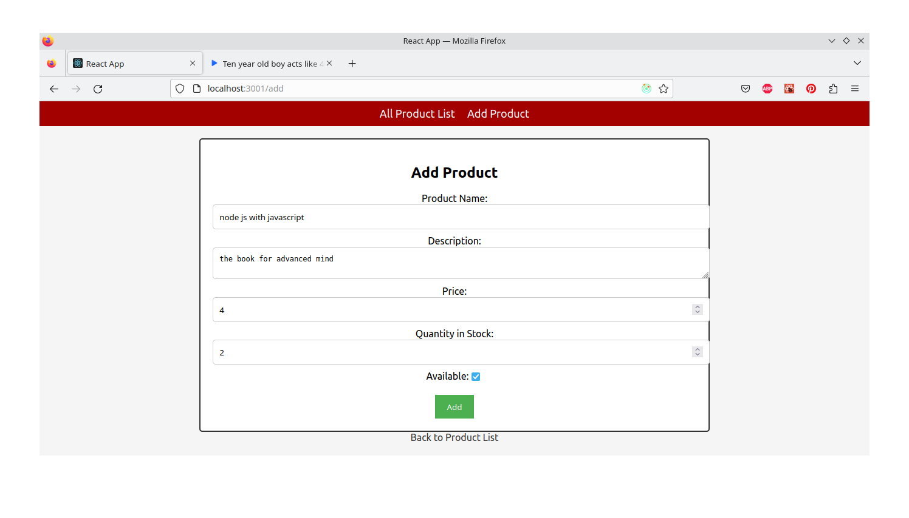
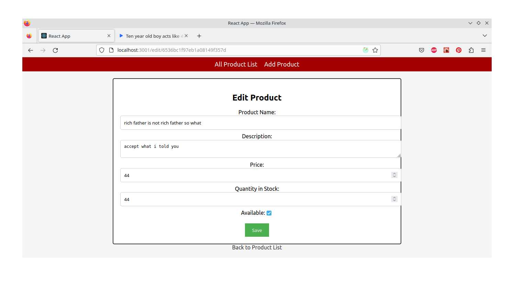

# React Nodejs Product Crud APP
## Available Scripts

In the project directory, you can run:

cd client 
npm install
### `npm start`

cd server

npm install
### `npm start`

### `Create .env file and add PORT AND DB_URL inside root folder of server`

### ` DO NOT FORGET TO CHANGE PORT NUMBER SAME AS YOURS FOR SERVER or .env port number 
to ~/client/src/constants/apiEndPoints.js
`

Runs the app in the development mode.\
Open [http://localhost:3000](http://localhost:3000) to view it in your browser.

The page will reload when you make changes.\
You may also see any lint errors in the console.

### `npm test`

Launches the test runner in the interactive watch mode.\
See the section about [running tests](https://facebook.github.io/create-react-app/docs/running-tests) for more information.

### `npm run build`

 
### Screenshots

Here are some screenshots of the app:

### `npm run eject`
